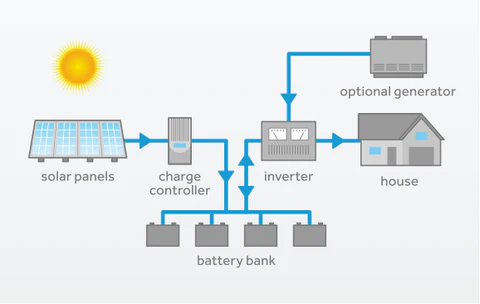

# Solar_Home_Assistant
Reinforcement Learning agent for off-grid solar energy management. The agent learns to schedule home appliance usage based on solar production, battery state, and time of day to maximize energy autonomy.

## 🧠 Goal

Train an RL agent to **schedule appliance usage** based on:
- Time of day
- Battery charge level
- Current solar energy production
- IntraDay forecast
- Day-ahead forecast
- Weekly forecast
- Month of the year

The objective is to **maximize energy autonomy** while minimizing energy waste or outages.

The reward function is designed to teach the agent when to run an appliance while avoiding blackouts and managing battery health. Here's how the incentives work:

+20 → When the agent successfully runs the appliance (i.e. battery has enough charge).

−5 → Penalty for trying to run the appliance when the battery is too low.

−1 → Efficiency penalty at every step to encourage quicker, more efficient decisions.

−5 → Additional penalty if battery drops below a safe threshold (2 kWh), encouraging conservative usage.

−50 → Heavy penalty for a blackout (battery completely depleted).

This setup balances reward for achieving the goal, with punishments for poor energy management, and encourages the agent to:

Plan ahead for sufficient battery charge,

Avoid unnecessary delays,

Run the appliance at the optimal time.

## 🚀 MVP Scenario

We simulate a week in an off-grid home:
- A battery charged only by solar energy
- One energy-intensive appliance (e.g., washing machine)
- The appliance must be run as often as possible
- The agent chooses **when** to run it
- If run at the right time, the battery has enough power
- If run at the wrong time, the battery might be empty and incur penalties

This is framed as a custom OpenAI Gym environment (`SolarApplianceEnv`).
